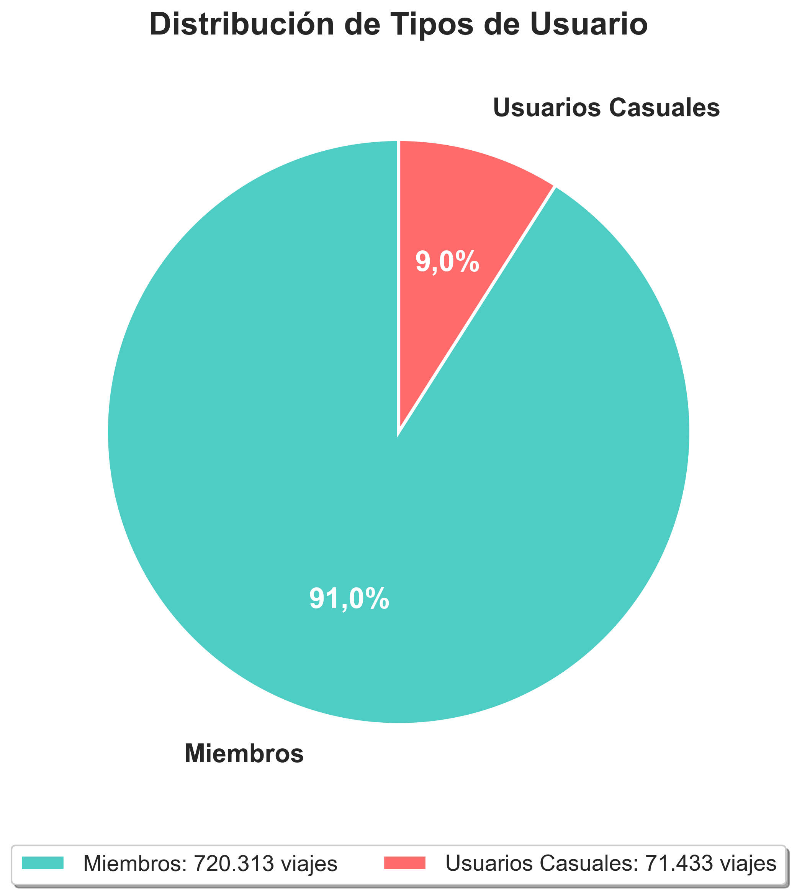
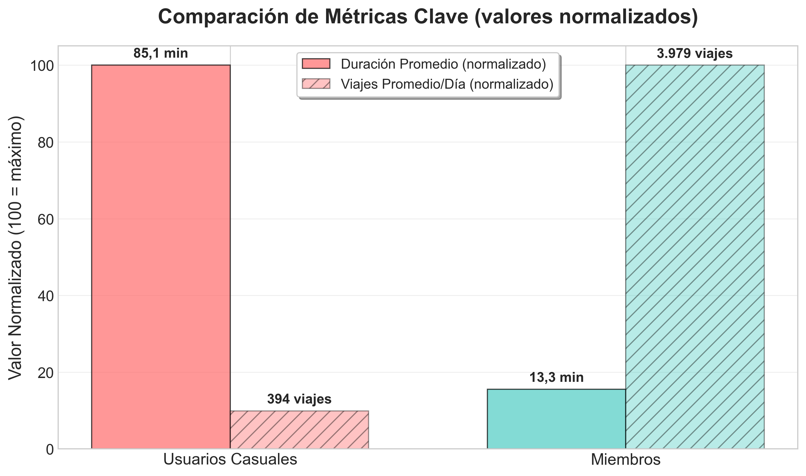
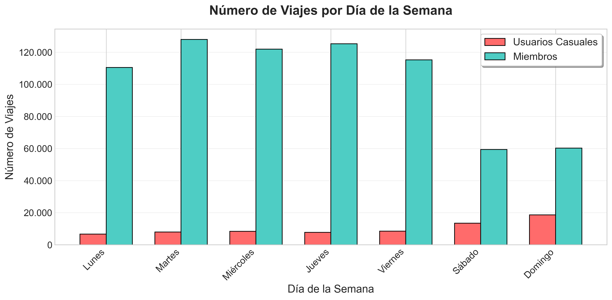
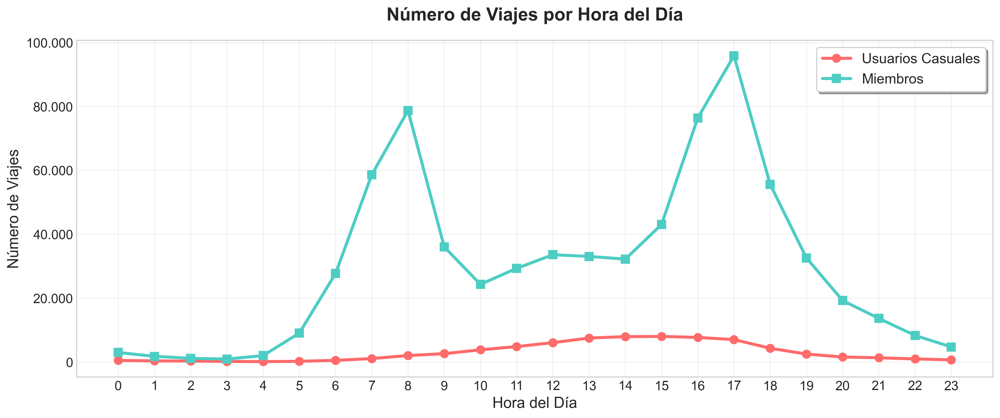
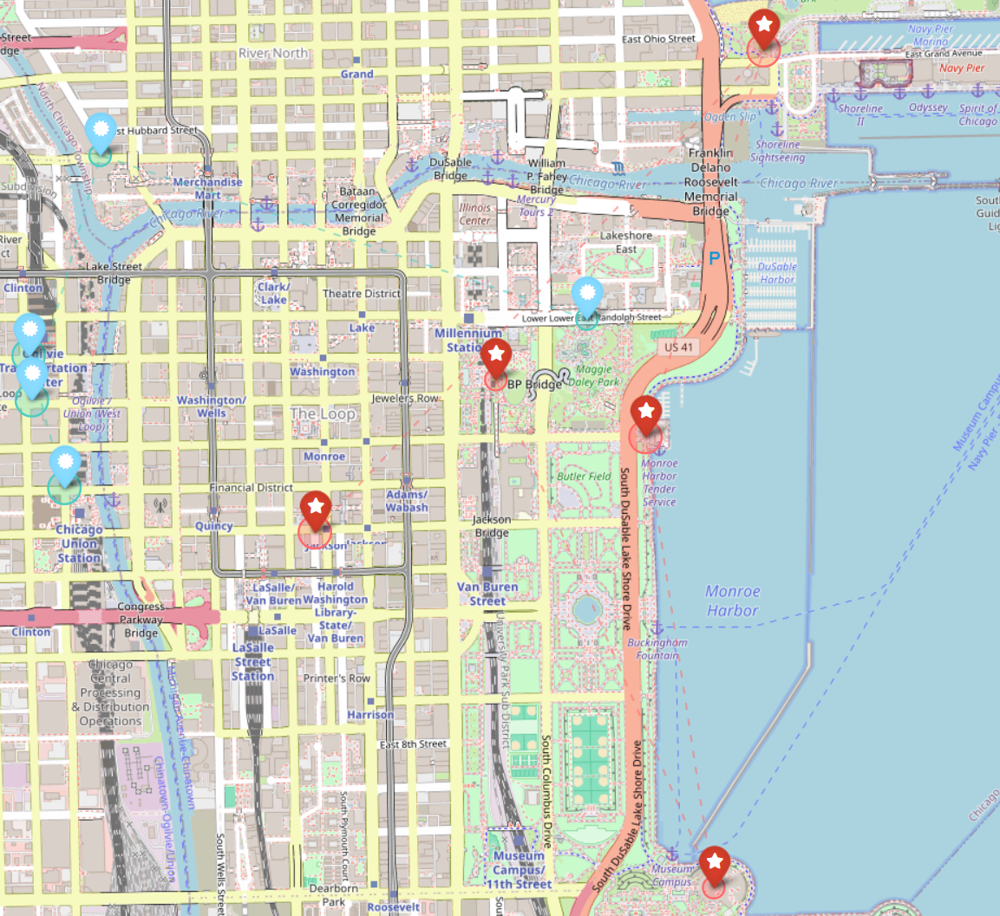

# Caso de Estudio Cyclistic

## Contexto del Proyecto

Cyclistic es un programa de bicicletas compartidas en Chicago que cuenta con más de 5.800 bicicletas y 600 estaciones de acoplamiento. La empresa ofrece opciones inclusivas como bicicletas reclinadas, triciclos de mano y bicicletas de carga, atendiendo a personas con discapacidades y usuarios que no pueden usar bicicletas tradicionales de dos ruedas.

Los analistas financieros de Cyclistic han determinado que los miembros anuales (aquellas personas que compran una membresía anual) son significativamente más rentables que los usuarios casuales (quienes compran pases de un solo viaje o de día completo). Por lo tanto, maximizar el número de membresías anuales es clave para el crecimiento futuro de la empresa.

El análisis realizado se centra en reponder la pregunta "¿De qué manera los miembros anuales y los usuarios casuales utilizan las bicicletas de Cyclistic de forma diferente?" describiendo el comportamiento de los usuarios casuales y cómo este difiere de aquel de los miembros anuales para ayudar al equipo de marketing a generar políticas de conversión.

## Estructura de los datos

Se analizó información histórica sobre viajes de Cyclistic combinando datos de los primeros trimestres de 2019 y 2020 en donde cada registro equivale a un viaje en bicicleta, llegando a un total de 791.746 registros. Los datos utilizados provienen de [Divvy](https://divvy-tripdata.s3.amazonaws.com/index.html).

Las variables claves son las siguientes:
- **member_casual**: Tipo de cliente (Miembro o Casual)
- **ride_length**: Duración del viaje
- **day_of_week**: Día en que se realizó el viaje
- **month**: Mes en que se realizó el viaje
- **start_hour**: Hora de inicio del viaje

Previo al comienzo del análisis, se realizaron procesos de chequeo de calidad y limpieza de los datos utilizando Python.

## Resumen ejecutivo

### Síntesis de los hallazgos

Existen diferencias fundamentales en el comportamiento de usuarios casuales y miembros anuales de Cyclistic. Los usuarios casuales, aunque representan solo el 9% del total de viajes, realizan trayectos 6 veces más largos que los miembros y concentran el 45% de su uso en fines de semana, con preferencia por estaciones ubicadas en zonas turísticas y recreativas como Streeter Dr & Grand Ave, Lake Shore Dr y Millennium Park. Este patrón contrasta significativamente con los miembros anuales, quienes muestran un perfil utilitario caracterizado por viajes cortos y frecuentes distribuidos uniformemente durante días laborales, con picos de actividad a las 08:00 y 17:00 horas con concentración en estaciones del distrito financiero como Canal St y Clinton St, indicando uso primario para desplazamientos al trabajo.

Los hallazgos sugieren que los usuarios casuales perciben a Cyclistic principalmente como una opción de ocio y turismo, mientras que los miembros lo utilizan como medio de transporte cotidiano.

## Distribución de usuarios y duración de viajes

La distribución de usuarios muestra una predominancia clara de miembros anuales en el sistema:

- **91% de los viajes** son realizados por miembros anuales (720.313 viajes), mientras que solo el **9% corresponden a usuarios casuales** (71.433 viajes)
- Los usuarios casuales realizan viajes con una duración promedio de **85,1 minutos**, en contraste con el promedio de **13,3 minutos** por viaje de los miembros anuales, esta diferencia del **542%** sugiere que los usuarios casuales utilizan el servicio para actividades recreativas y exploratorias, mientras que los miembros lo usan para desplazamientos específicos y rutinarios

## Uso del servicio durante la semana

El análisis sobre el uso del servicio durante la semana revela comportamientos claramente diferenciados:

- Los usuarios casuales concentran su actividad durante los **fines de semana**, con picos significativos los sábados y domingos (13.473 y 18.652 viajes respectivamente)
- El **domingo es el día más popular** para usuarios casuales, representando el 26% de sus viajes semanales
- Los miembros muestran un patrón inverso, con **uso distribuido uniformemente durante días laborales** y picos los martes y jueves (127.974 y 125.228 viajes)

## Horarios de Uso y Propósito de Viaje

Los patrones horarios revelan los propósitos subyacentes de uso para cada grupo:

- Los miembros exhiben dos picos claros coincidentes con horarios de conmutación: **8:00 AM (entrada laboral) y 17:00 PM (salida laboral, con 95.865 viajes)**
- Los usuarios casuales muestran un patrón más distribuido con pico único a las **15:00 (7.985 viajes)**, consistente con actividades de ocio vespertinas
- La ausencia de picos matutinos entre usuarios casuales confirma que **no están usando el servicio para commuting regular**

## Segregación Geográfica de Usuarios

El análisis geográfico de estaciones revela una clara segregación espacial entre ambos grupos de usuarios:

- **Las 5 estaciones más populares para los usuarios casuales (En rojo)** están ubicadas en zonas turísticas y recreativas: Streeter Dr & Grand Ave (Navy Pier área), Lake Shore Dr & Monroe St (frente al lago), Shedd Aquarium, y Millennium Park
- **Las 5 estaciones más populares para los miembros anuales (En celeste)** se concentran en el distrito financiero (Loop): Canal St & Adams St, Clinton St & Washington Blvd, Clinton St & Madison St
- Esta segregación geográfica confirma la hipótesis de **diferentes propósitos de uso**: turismo/recreación vs. commuting laboral
- La falta de superposición entre estaciones populares sugiere que **ambos grupos raramente interactúan**, implicando que usuarios casuales pueden no estar conscientes de los beneficios de commuting del sistema

## Síntesis de Hallazgos

El análisis revela dos perfiles de usuario completamente distintos que convergen en el mismo sistema pero con motivaciones divergentes.

### Perfil del Usuario Casual:
- Uso recreativo y turístico
- Viajes largos (85+ minutos)
- Concentración en fines de semana (45%)
- Horario flexible (pico 15:00)
- Estaciones turísticas (lakefront, parques)

### Perfil del Miembro Anual:
- Uso utilitario de commuting
- Viajes cortos y eficientes (13 minutos)
- Concentración en días laborales (83%)
- Horarios de conmutación (picos 8:00 y 17:00)
- Estaciones comerciales (Loop, distrito financiero)

## Recomendaciones

Estos hallazgos sugieren que la estrategia de conversión no debe intentar cambiar radicalmente el comportamiento de usuarios casuales, sino crear productos y mensajes que se adapten a sus patrones existentes. Una membresía "única para todos" no captura el valor que diferentes segmentos obtienen del servicio. Las oportunidades de mayor impacto incluyen:

1. **Productos de membresía diferenciados** (fin de semana, uso ocasional, completa)
2. **Mensajes de ahorro personalizados** basados en historial de uso individual ("Has gastado $X este mes. Con membresía anual habrías ahorrado $Y")
3. **Marketing geográfico** en estaciones turísticas
4. **Educación sobre usos adicionales** del servicio más allá de recreación

